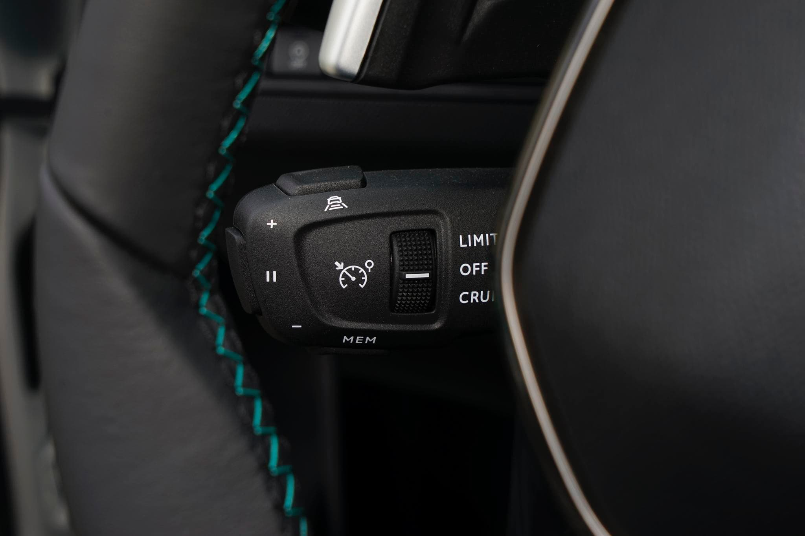
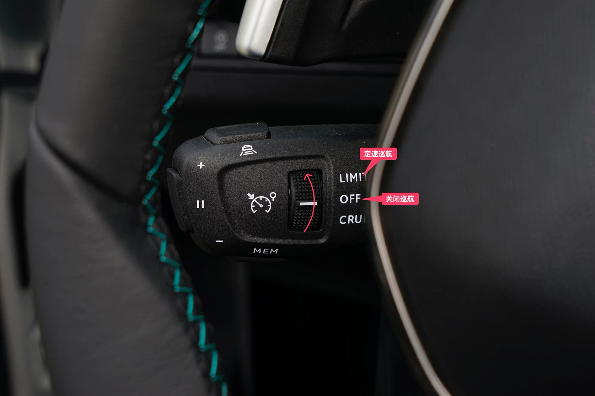
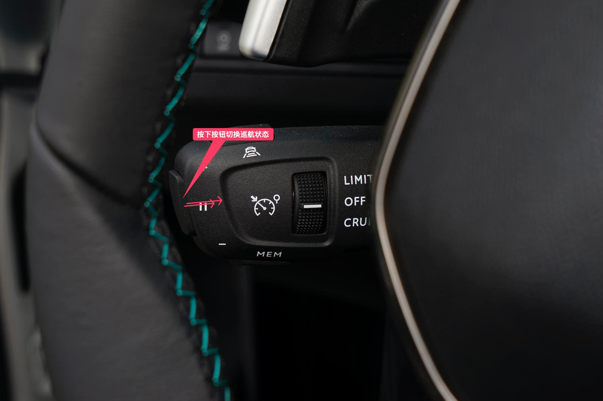
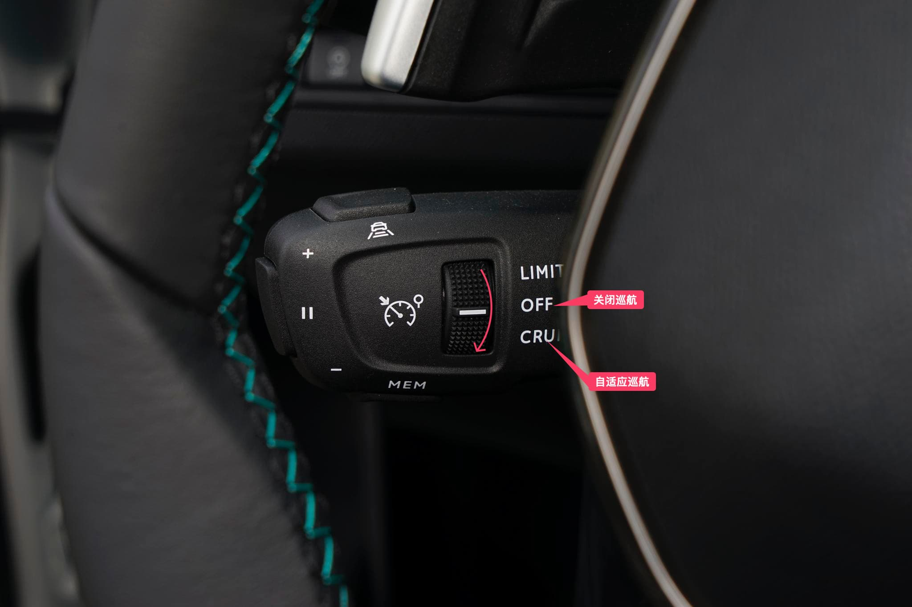
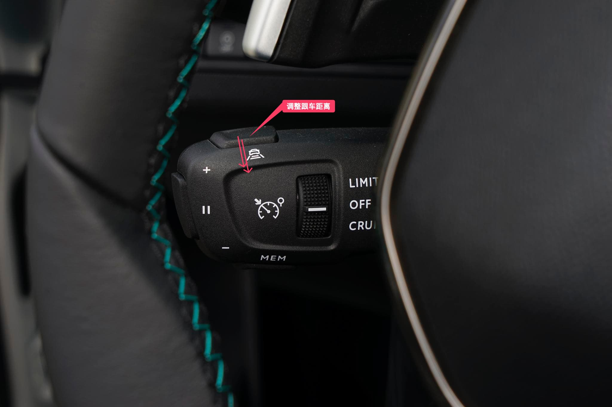

# 巡航系统 {#cruise-control-system}

当在道路条件良好的高速上开启定速巡航或自适应巡航驾驶车辆，合理的使用巡航系统能减少驾驶的疲劳从而带来更好的驾驶体验。

标致 4008 科技版支持巡航系统，包括定速巡航和自适应巡航(ACC)系统。

巡航系统的操作杆在主驾驶位的左边灯光控制杆的下方，在正常驾驶时不容易发现它的存在。

::: details 查看巡航系统操作杆

:::

巡航的基本的操作逻辑包括：

1. 使用中间的旋钮选择巡航功能，向上为定速巡航 **`LIMIT`** ，向下为自适应巡航 **`CRUISE`**
2. 下方 **`+`**、**`-`** 按钮来调整定速巡航速度或自适应巡航初始/最大速度
3. 左侧切换定速巡航 **`LIMIT`**、自适应巡航 **`CRUISE`** 开启或者关闭状态
4. 下方 **`MEM`** 为使用限速提醒系统建议的车速值

## 定速巡航 {#cruise-control}

定速巡航，顾名思义定速巡航是汽车以一定的速度巡航，不需要驾驶员进行踩油门操作，巡航需要高于 30km/h 的速度才能使用。

通常适用于道路交通良好的高速公路上使用。

下面简单介绍一下定速巡航的一些基本操作：包括开启定速巡航、MEM 存储车速、调节巡航速度、巡航模式超车和退出定速巡航。

### 开启定速巡航 {#toggle-cruise-control}

在车速行驶到一定速度后，将拨杆拨动到 **`LIMIT`** 时可以开启定速巡航。

::: details 开启定速巡航

:::

### `MEM` 存储车速 {#mem-store-speed}

<!--@include: ./_partials/cruise-mem-store-speed.md-->

### 调节巡航速度 {#adjust-cruise-speed}

<!--@include: ./_partials/cruise-adjust-speed.md-->

::: details 通过 `MEM` 记忆值调节按钮选择巡航速度

:::

### 巡航模式超车 {#cruise-overtaking}

在定速巡航模式下需要临时提高车速来超越右侧车辆，可以通过踩踏加速踏板来提高车速快速超越右侧车辆，超车完毕后确定车道安全后松开加速踏板车速会慢慢降低到定速巡航设定的速度行驶。

### 退出定速巡航 {#exit-cruise-control}

退出定速巡航系统有如下几种操作方式：

1. 将巡航拨杆拨动到 **`OFF`** 状态来停止定速巡航
2. 按左侧按钮临时切换巡航状态，开启或者暂停
   ::: details 按下左侧按钮切换巡航状态
   
   :::
3. 踩下制动踏板来退出定速巡航

## 自适应巡航 {#adaptive-cruise-control}

自适应巡航(ACC) 比定速巡航较为智能且一般在较低的速度下即能进入巡航。

除了高速路况，也能适用于城市路况，在一定程度上减轻驾驶人员驾驶的疲劳。

相比于定速巡航，自适应巡航增加了跟车距离设定，自动增、减行车速度、跟停功能。

下面简单介绍一下自适应巡航的一些基本操作：包括开启自适应巡航、MEM 存储车速、调节巡航速度、巡航模式超车、调整跟车距离和退出自适应巡航。

### 开启自适应巡航 {#toggle-adaptive-cruise}

在车速行驶到一定速度后，将拨杆拨动到 **`CRUISE`** 时可以开启自适应巡航。

::: details 开启自适应巡航

:::

### `MEM` 存储车速 {#mem-store-speed-adaptive}

<!--@include: ./_partials/cruise-mem-store-speed.md-->

### 调节巡航速度 {#adjust-adaptive-cruise-speed}

<!--@include: ./_partials/cruise-adjust-speed.md-->

::: details 通过 `MEM` 记忆值调节按钮选择巡航速度

:::

### 巡航模式超车 {#cruise-overtaking-adaptive}

在自适应巡航模式下需要临时提高车速来超越右侧车辆，可以通过踩踏加速踏板来提高车速快速超越右侧车辆，超车完毕后确定车道安全后松开加速踏板车速会慢慢降低到自适应巡航设定的最高速度行驶。

### 调整跟车距离 {#adjust-following-distance}

开启自适应巡航后，通过点击上方的按钮可以切换跟车距离，提供 3 个预设的车距值供选择（在仪表盘上显示）：

- **远**（3 条横杠）
- **标准**（2 条横杠）
- **近**（1 条横杠）

::: details 调整跟车距离

:::

可以通过上方按钮修改跟车距离：

1. 按压按键进入跟车距离选择；
2. 重复按压按键可以在不同的跟车距离间切换。

确认跟车距离后修改随之生效。

### 退出自适应巡航 {#exit-adaptive-cruise}

退出自适应巡航系统有如下几种操作方式：

1. 将巡航拨杆拨动到 **`OFF`** 状态来停止自适应巡航
2. 按左侧按钮临时切换巡航状态，开启或者暂停
   ::: details 按下左侧按钮切换巡航状态
   
   :::
3. 踩下制动踏板来退出自适应巡航

## 使用案例 {#usage-example}

当道路前方没有车辆时，自适应巡航（ACC）会以一定的速度巡航，巡航的车速在设定的车速限值范围内

- 当雷达监测范围内出现车辆时，如果车速过高且车辆之间的距离不足时，汽车会减速，并以一定的车速跟随前车行驶，保持安全距离
- 若前车离开当前行驶的车道，则本车会自动加速至设定车速

## 最佳实践 {#best-practices}

巡航系统是降低长途驾驶疲劳的辅助工具，用好它的前提是清楚它的边界：

- **只在道路条件良好的高速或快速路上开启**：城市拥堵、频繁变道、进出匝道的路段更适合人工驾驶。
- **先把车速调到与限速匹配再开启**：巡航车速与道路限速保持一致，避免在巡航状态下反复加减速。
- **根据天气与车流选择跟车距离**：雨、雾、夜间或车流密集时把跟车距离调到「远」，车距过近时自适应巡航的制动会更频繁、更突兀。
- **进出匝道、收费站、隧道前主动退出**：这些场景需要提前预判减速，交给人工控制更稳妥。
- **需要超车时用加速踏板临时提速**：超越完成后松开加速踏板，车速会自动回落到设定值。
- **不踩油门时把脚移到制动踏板上方**：缩短紧急情况下的反应时间。

> [!TIP] <strong>提示：</strong>
>
> `+`、`-` 按钮短按调整 1km/h，长按调整 5km/h，接近目标车速时先长按再短按微调更省事。

通用用车建议见[最佳实践](/guide/basic/best-practices)。

> [!WARNING] <strong>注意：</strong>
>
> 定速巡航与自适应巡航都属于驾驶辅助功能，雨雪湿滑、能见度低或雷达、摄像头被遮挡时应谨慎使用或直接关闭，驾驶员始终对制动与转向负责。
