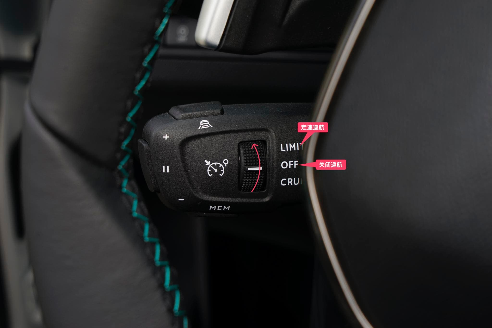

# 巡航系统

当在道路条件良好的高速上开启定速巡航或自适应巡航驾驶车辆，能减少驾驶的疲劳从而带来更好的驾驶体验。

标致 4008 科技版支持巡航系统，包括定速巡航和自适应巡航(ACC)系统。

巡航系统的操作杆在主驾驶位的左边灯光控制杆的下方，在正常驾驶时不容易发现它的存在。

::: details 查看巡航系统操作杆

:::

巡航的基本的操作逻辑包括：

1. 使用中间的旋钮选择巡航功能，向上为定速巡航 **`LIMIT`** ，向下为自适应巡航 **`CRUISE`**
2. 下方 **`+`**、**`-`** 按钮来调整定速巡航速度或自适应巡航初始/最大速度
3. 左侧切换定速巡航 **`LIMIT`**、自适应巡航 **`CRUISE`** 开启或者关闭状态
4. 下方 **`MEM`** 为显示车速记忆值、存储限速提醒系统建议的车速值或者使用限速提醒系统建议的车速值

## 定速巡航

定速巡航，顾名思义定速巡航是汽车以一定的速度巡航，不需要驾驶员进行踩油门操作，巡航需要高于 30km/h 的速度才能使用。

通常适用于道路交通良好的高速公路上使用。

下面简单介绍一下定速巡航的一些基本操作：包括开启定速巡航、MEM 存储车速、调节巡航速度、巡航模式超车和退出定速巡航。

### 开启定速巡航

在车速行驶到一定速度后，将拨杆拨动到 **`LIMIT`** 时可以开启定速巡航。

::: details 开启定速巡航

:::

### `MEM` 存储车速

开启定速巡航或自适应巡航功能时，其信息会在组合仪表上显示对应符号标识。

当探测到限速牌，系统会显示限速车速值并提示可将其存储为一个新的车速记忆值，`MEM`提示会在屏幕上闪烁几秒钟。

点击 **`MEM`** 车速记忆按键来响应系统建议的车速值，再次按下车速记忆按键来确认与保存此车速值。

> 如果探测到的限速值与设定的限速值差异在 10km/h 以内，`MEM` 标识将不会显示。

### 调节巡航速度

调节巡航速度有两种方式：一种是用过 `+`、`-` 按钮调节；另一种是通过选择车速记忆值来调整巡航车速值。

#### 通过 `+` `-` 按钮调节
当开启车辆巡航时，可以通过巡航操作杆下面的 **`+`**、**`-`** 按钮来增加、降低巡航行驶的初始、最大速度。

> **注意**：巡航速度的调节区分长按和短按。
>
> 短按：以 1km/h 的幅度进行增加或降低车速；
>
> 长按：以 5km/h 的服务进行增加或降低车速；

#### 通过 `MEM` 记忆值调节按钮

按下 **`MEM`** 按键，在仪表盘会显示存储的 6 个车速值，点击切换到所需要的车速值，设定将成为新的巡航车速值。

::: details 通过 `MEM` 记忆值调节按钮选择巡航速度

:::

### 巡航模式超车

在定速巡航模式下需要临时提高车速来超越右侧车辆，可以通过踩踏加速踏板来提高车速快速超越右侧车辆，超车完毕后确定车道安全后松开加速踏板车速会慢慢降低到定速巡航设定的速度行驶。

### 退出定速巡航

退出定速巡航系统有如下几种操作方式：

1. 将巡航拨杆拨动到 **`OFF`** 状态来停止定速巡航
2. 按左侧按钮临时切换巡航状态，开启或者暂停
   ::: details 按下左侧按钮切换巡航状态
   
   :::
3. 踩下制动踏板来退出定速巡航

## 自适应巡航

自适应巡航(ACC) 比定速巡航较为智能且一般在较低的速度下即能进入巡航。

除了高速路况，也能适用于城市路况，在一定程度上减轻驾驶人员驾驶的疲劳。

相比于定速巡航，自适应巡航增加了跟车距离设定，自动增、减行车速度、跟停功能。

下面简单介绍一下自适应巡航的一些基本操作：包括开启自适应巡航、MEM 存储车速、调节巡航速度、巡航模式超车、调整跟车距离和退出自适应巡航。

### 开启自适应巡航

在车速行驶到一定速度后，将拨杆拨动到 **`CRUISE`** 时可以开启自适应巡航。

::: details 开启自适应巡航

:::

### `MEM` 存储车速

开启定速巡航或自适应巡航功能时，其信息会在组合仪表上显示对应符号标识。

当探测到限速牌，系统会显示限速车速值并提示可将其存储为一个新的车速记忆值，`MEM`提示会在屏幕上闪烁几秒钟。

点击 **`MEM`** 车速记忆按键来响应系统建议的车速值，再次按下车速记忆按键来确认与保存此车速值。

> 如果探测到的限速值与设定的限速值差异在 10km/h 以内，`MEM` 标识将不会显示。

### 调节巡航速度

调节巡航速度有两种方式：一种是用过 `+`、`-` 按钮调节；另一种是通过选择车速记忆值来调整巡航车速值。

#### 通过 `+` `-` 按钮调节
当开启车辆巡航时，可以通过巡航操作杆下面的 **`+`**、**`-`** 按钮来增加、降低巡航行驶的初始、最大速度。

> **注意**：巡航速度的调节区分长按和短按。
>
> 短按：以 1km/h 的幅度进行增加或降低车速；
>
> 长按：以 5km/h 的服务进行增加或降低车速；

#### 通过 `MEM` 记忆值调节按钮

按下 **`MEM`** 按键，在仪表盘会显示存储的 6 个车速值，点击切换到所需要的车速值，设定将成为新的巡航车速值。

::: details 通过 `MEM` 记忆值调节按钮选择巡航速度

:::

### 巡航模式超车

在自适应巡航模式下需要临时提高车速来超越右侧车辆，可以通过踩踏加速踏板来提高车速快速超越右侧车辆，超车完毕后确定车道安全后松开加速踏板车速会慢慢降低到自适应巡航设定的最高速度行驶。

### 调整跟车距离

开启自适应巡航后，通过点击上方的按钮可以切换跟车距离，提供 3 个预设的车距值供选择（在仪表盘上显示）：

- **远**（3 条横杠）
- **标准**（2 条横杠）
- **近**（1 条横杠）

::: details 调整跟车距离

:::

可以通过上方按钮修改跟车距离：

1. 按压按键进入跟车距离选择；
2. 重复按压按键可以在不同的跟车距离间切换。

确认跟车距离后修改随之生效。

### 退出自适应巡航

退出自适应巡航系统有如下几种操作方式：

1. 将巡航拨杆拨动到 **`OFF`** 状态来停止自适应巡航
2. 按左侧按钮临时切换巡航状态，开启或者暂停
   ::: details 按下左侧按钮切换巡航状态
   
   :::
3. 踩下制动踏板来退出自适应巡航

## 使用案例

当道路前方没有车辆时，自适应巡航（ACC）会以一定的速度巡航，巡航的车速在设定的车速限值范围内
   - 当雷达监测范围内出现车辆时，如果车速过高且车辆之间的距离不足时，汽车会减速，并以一定的车速跟随前车行驶，保持安全距离
   - 若前车离开当前行驶的车道，则本车会自动加速至设定车速

