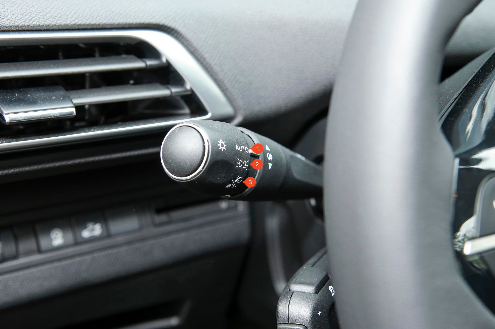
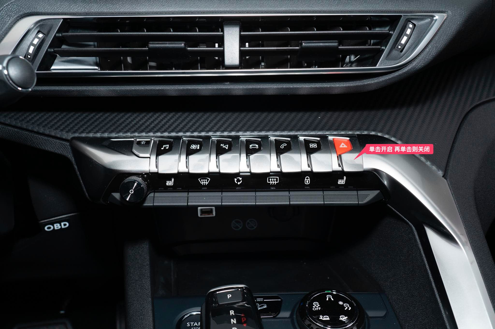
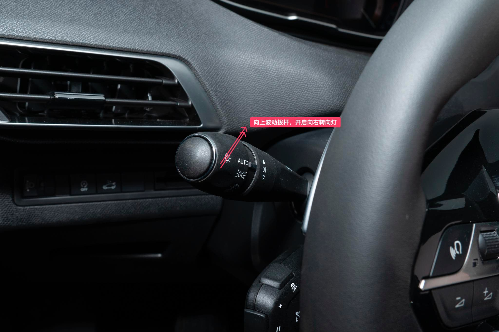
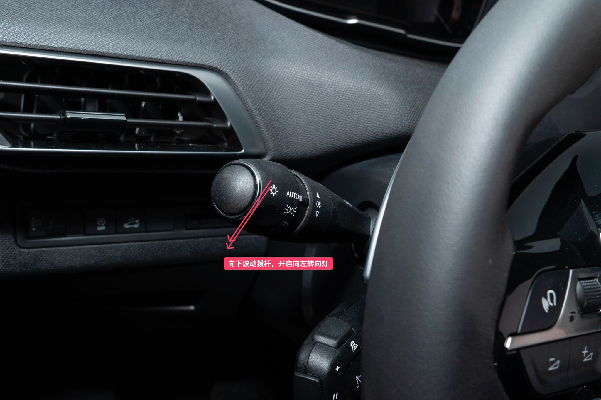

# 外部灯光控制 {#external-lighting-control}

汽车的灯光对于日常车辆驾驶时来说至关重要，合理的使用灯光可以增加驾驶安全性。比如：

- 在晚上行车时，需要用到远、近光灯
- 在白天行车时，需要开启日间行车灯
- 在雾天行车时，需要开启位置灯、后雾灯
- 在需要变道或超车时，需要使用转向灯
- 在遇前方道路障碍或车辆出现故障时，需要开启警示灯（双闪）

以上是一些在开车时常见的灯光控制，标致 4008 的近光灯控制旋钮在主驾驶方向盘左手边，下面结合上面的例子一起来看下标致 4008
对应的灯光操作。

## 近光灯 {#low-beam-lights}

近光灯是最常使用的灯光，为了照明的同时也为了引起其他交通参与者的注意。

它的一些使用场景包括：

- 在进隧道前，应该提前开启近光灯
- 在天色稍暗，视线开始稍有吃力的时候，应该开启近光灯
- 在夜间照明条件比较好的路上行驶时，应该使用近光灯

::: details 查看近灯光控制预览图

:::

下面看一下如何开启近光灯：

- 方式一：将旋钮旋转到远/近光灯处，默认开启近光灯

- 方式二：将旋钮旋转到 `AUTO` 自动灯光，会自动根据环境开启近光灯

## 远光灯 {#high-beam-lights}

远光灯相比近光灯，它的特点是角度要高，亮度要强，照射距离远。

它的使用场景包括：

- 在一些照明条件较差的道路上驾驶远光灯，可以与近光灯交替使用
- 夜间超车时，应交替使用远近光灯提醒前方车辆
- 在没有路灯或夜间照明不良的道路上，且道路对面没有车辆的时候开启

不建议使用它的场景有：

- 在会车时使用会导致对向车辆视线模糊，妨碍他人正常行驶
- 在跟车时，也不应该使用远光灯，妨碍前方车辆正常行驶

::: details 查看近灯光控制预览图

:::

下面看一下如何开启远光灯，远光灯的开启是在近光灯的基础上进行的操作：

- 方式一：将旋钮旋转到远/近光灯处，默认开启近光灯，然后**向内拨到底则开启远光灯，再次向内拨到底则关闭远光灯回到近光灯。**

- 方式二：将旋钮旋转到 `AUTO` 自动灯光，会自动根据环境开启近光灯，然后**向内拨到底则开启远光灯，再次向内拨到底则关闭远光灯回到近光灯。**

## 日间行车灯 {#daytime-running-lights}

日行灯的作用不是为了照明，而是为了让别人知晓自己的存在。**当光线充足的情况下灯光控制杆位于 `AUTO` 位置时自动点亮**。

在高速公路上行驶时，开启日行灯的车辆更容易被前车发现。

## 雾灯 {#fog-lights}

雾灯的使用场景一般是在起雾、下雨、雪、沙尘、冰雹等能见度低的时候使用，它在极端条件下穿透力极强，最关键的作用是提示他人。

它的使用可以参考[切换雾灯](/guide/others/faqs.md#switch-fog-lights)。

## 位置灯 {#position-lights}

位置灯(示廓灯)，顾名思义，通过这种灯，别人能知道你车身的宽度(轮廓)，是一种信号提示灯。

光线不足的情况下灯光控制杆位于 `AUTO` 位置，或者直接处于 `位置灯` 档位，或者位于 `近光灯 / 远光灯`档位。

::: details 查看示廓灯控制预览图

:::

## 危险警示灯 {#hazard-warning-lights}

危险警示灯（双闪）当行驶的道路出现问题或汽车出现故障时，到警示周边交通参与者的作用。

它位于中控钢琴键做右侧的按键，按下开启，再次按下则关闭。

一般有如下使用场景：

- 当行驶到道路出现故障，需要开启危险警示灯
- 当行驶的汽车出现故障时，需要开启危险警示灯
- 大雾和大暴雨等极端天气情况下，也应该开启双闪

::: details 查看危险警示灯控制预览图

:::

## 转向灯 {#turn-signal-lights}

转向灯作用是告知其它交通参与者你当前的驾驶意图，常见于以下场景：

- 变道
- 转弯
- 超车
- 并道，由辅路并道到主路

### 向右转向 {#right-turn-signal}

操作方式：使用灯光控制拨杆向上轻拨，右转向灯闪三下，向上拨到底，右转向灯常闪。

::: details 查看向右转向灯控制预览图

:::

### 向左转向 {#left-turn-signal}

操作方式：使用灯光控制拨杆向下轻拨，左转向灯闪三下，向下拨到底，左转向灯常闪。

::: details 查看向左转向灯控制预览图

:::
