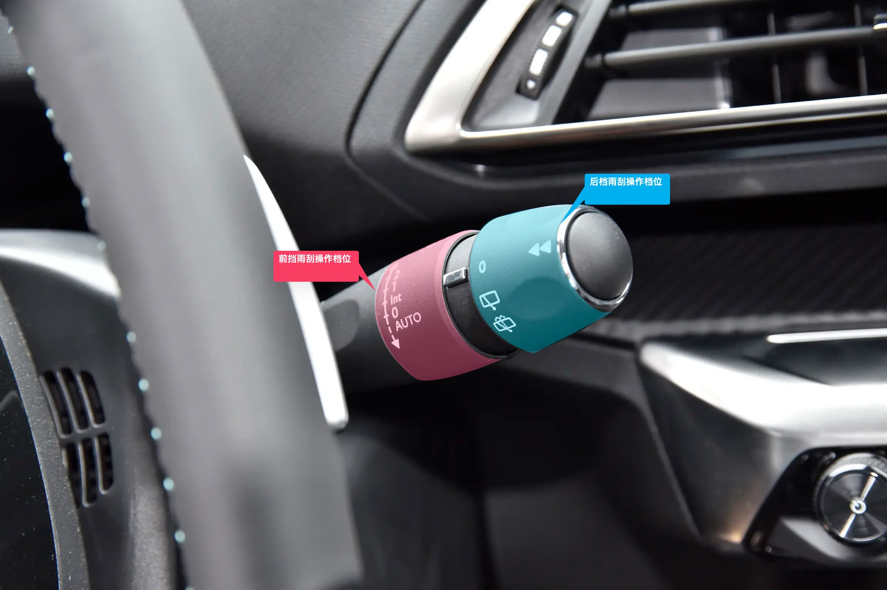
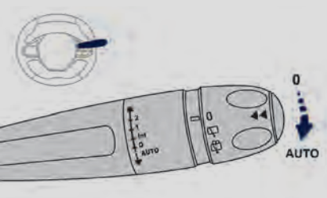
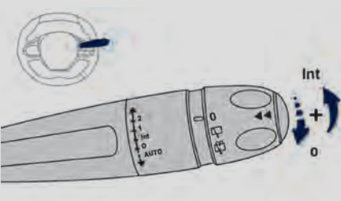
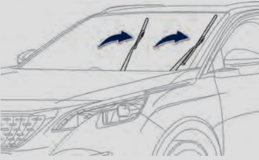

# 雨刮器

标致 4008 科技版的雨刮操作杆位于主驾驶位方向盘的右侧。包括前雨刮和后雨刮的操作：

## 前雨刮

档位包括：
- **`Int`** 间歇刮水（刮水频率与车速成正比）；
- **`1`** 正常刮水（中雨）；
- **`2`** 快速刮水（大雨）；
- **`0`** 关闭；
- **单次刮水** 向下拨或向内拉动控制杆，随后放开
- **自动刮水** 向下拨到底，随后松开，取消自动刮水则再次执行一次当前操作
- **清洗前风挡玻璃** 向内拉动控制杆一段时间，刮动雨刮器的同时会喷出玻璃水可以对风挡玻璃进行清洗

### 自动雨刮

位于前挡风玻璃上的传感器感应到下雨时，前雨刮自动工作，并根据降雨强度和车速调节刮水速度。

> **注意**：关闭点火开关超过一分钟后，自动雨刮默认关闭，再次使用时需要通过拨动组合开关来重新激活自动刮水功能。

#### 开启

向下拨组合开关组合仪表指示灯点亮，并伴随有提示信息。

#### 关闭

再次向下拨组合开关，或把开关拨到另一个位置（int ，1 或 2）组合仪表指示灯熄灭，并伴随有提示信息。

### 特殊位置

在点火开关关闭之后的短时间内，拨动雨刮组合开关，雨刮片将置于风窗玻璃中央。

在此情况下，可以清洁或更换雨刮片，冬季停车时也可使用此位置。接通点火开关后操作雨刮组合开关，可使雨刮片返回正常位置。

## 后雨刮

后雨刮选择旋钮：旋转旋钮，将所想要的档位与刻度对齐。

档位以此包括：
- **0** 停止
- 间歇刮水
- 后风窗清洗

转动旋钮到此档位：后风窗开始清洗，后雨刮会自动运行一段时间。
