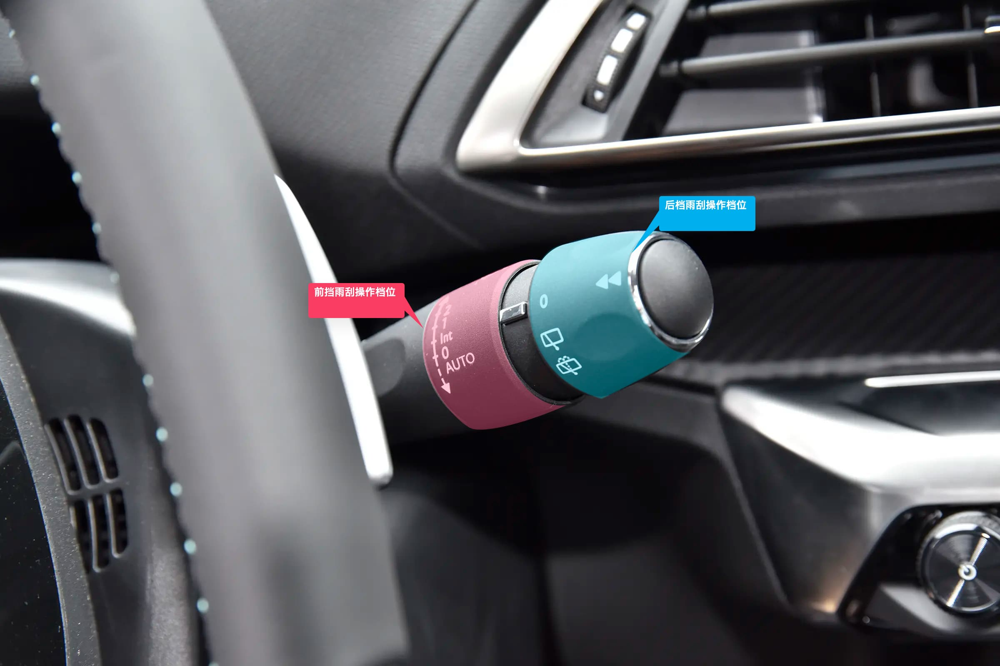
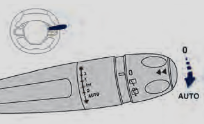
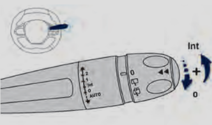
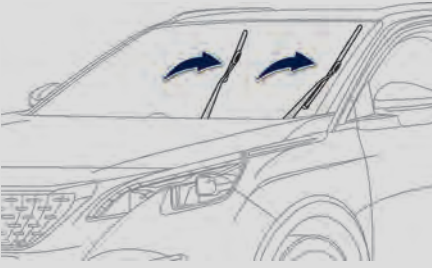

# 雨刮器 {#wiper}

标致 4008 科技版的雨刮操作杆位于主驾驶位方向盘的右侧。包括前雨刮和后雨刮的操作：

## 前雨刮 {#front-wiper}

档位包括：
- **`Int`** 间歇刮水（刮水频率与车速成正比）；
- **`1`** 正常刮水（中雨）；
- **`2`** 快速刮水（大雨）；
- **`0`** 关闭；
- **单次刮水** 向下拨或向内拉动控制杆，随后放开
- **自动刮水** 向下拨到底，随后松开，取消自动刮水则再次执行一次当前操作
- **清洗前风挡玻璃** 向内拉动控制杆一段时间，刮动雨刮器的同时会喷出玻璃水可以对风挡玻璃进行清洗

### 自动雨刮 {#wiper-auto-mode}

位于前挡风玻璃上的传感器感应到下雨时，前雨刮自动工作，并根据降雨强度和车速调节刮水速度。

> **注意**：关闭点火开关超过一分钟后，自动雨刮默认关闭，再次使用时需要通过拨动组合开关来重新激活自动刮水功能。

#### 开启 {#start-wiper-auto-mode}

向下拨组合开关组合仪表指示灯点亮，并伴随有提示信息。

#### 关闭 {#stop-wiper-auto-mode}

再次向下拨组合开关，或把开关拨到另一个位置（`Int`、`1` 或 `2`）组合仪表指示灯熄灭，并伴随有提示信息。

### 特殊位置 {#wiper-maintenance-mode}

在点火开关关闭之后的短时间内，拨动雨刮组合开关，雨刮片将置于风窗玻璃中央。

在此情况下，可以清洁或更换雨刮片，冬季停车时也可使用此位置。接通点火开关后操作雨刮组合开关，可使雨刮片返回正常位置。

## 后雨刮 {#rear-wiper}

后雨刮选择旋钮：旋转旋钮，将所想要的档位与刻度对齐。

档位依次包括：
- **0** 停止
- 间歇刮水
- 后风窗清洗

转动旋钮到此档位：后风窗开始清洗，后雨刮会自动运行一段时间。

## 最佳实践 {#best-practices}

雨刮是保持视野清晰的最后一道防线，日常维护比临时应对更重要：

- **玻璃水报警后尽快补充**：风窗清洗液不足时组合仪表会点亮警告灯，缺液时不要强行刮刷，加注方式见[加注玻璃水](/guide/others/faqs#fill-windshield-washer-fluid)。
- **按季节选择玻璃水**：冬季使用防冻型风窗清洗液，避免低温结冰损坏储液罐与管路。
- **结冰或积雪时先除冰再用雨刮**：冻住的雨刮片直接工作会撕裂胶条，也可能损伤雨刮电机。
- **换雨刮片、冬季停车时使用维护位置**：点火开关关闭后的短时间内拨动雨刮组合开关，雨刮片会停在风窗玻璃中央，便于清洁与更换。
- **定期清洁胶条与玻璃**：泥沙与树胶附着会降低刮拭效果，也可能在刮刷时划伤玻璃。
- **自动雨刮需要重新激活**：关闭点火开关超过一分钟后自动刮水功能默认关闭，再次使用时需拨动组合开关重新激活。

> [!TIP] <strong>提示：</strong>
>
> 间歇刮水档位（`Int`）的刮水频率与车速成正比，车速提高时无需手动升档。

通用用车建议见[最佳实践](/guide/basic/best-practices)。

> [!WARNING] <strong>注意：</strong>
>
> 不要在没有风窗清洗液的情况下长时间刮刷，干刮会加速胶条磨损并可能划伤玻璃。
