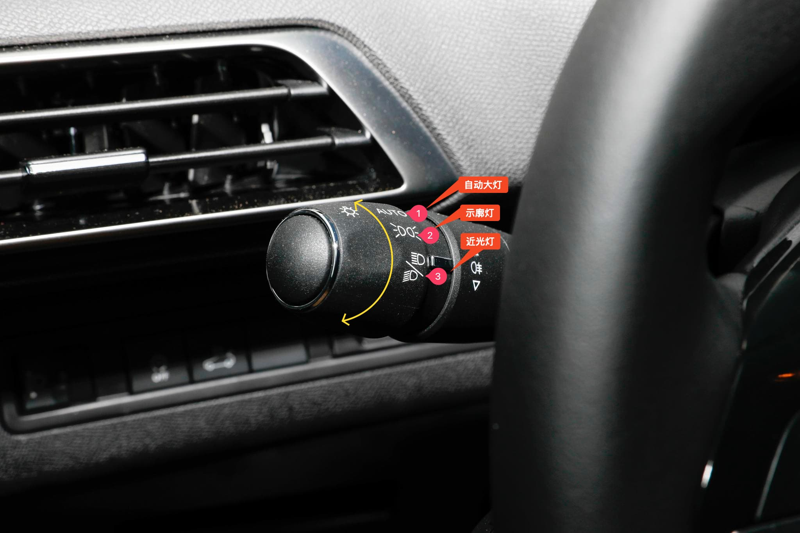
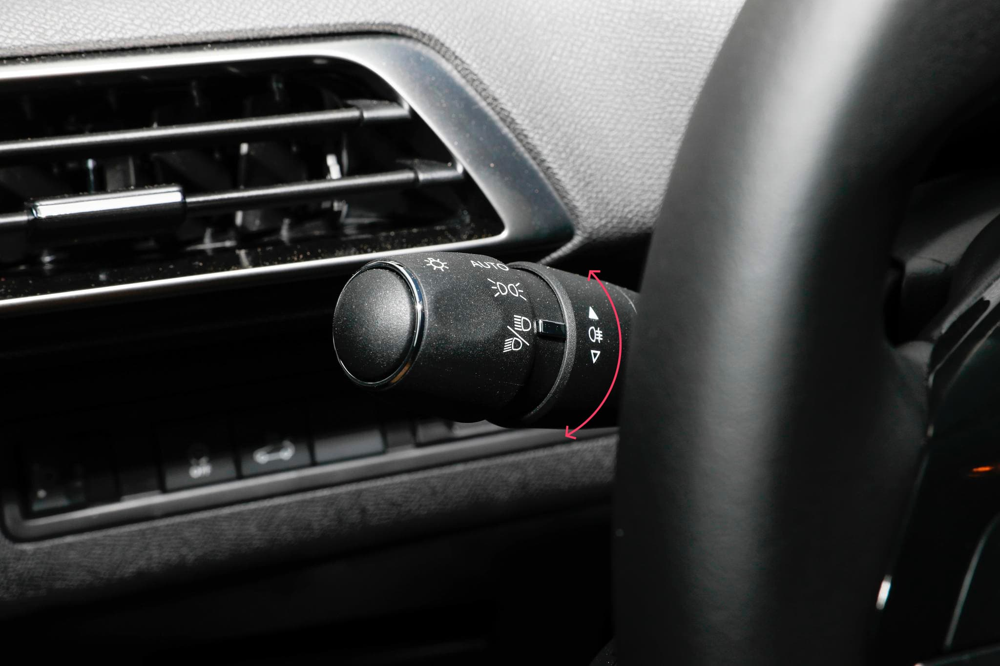
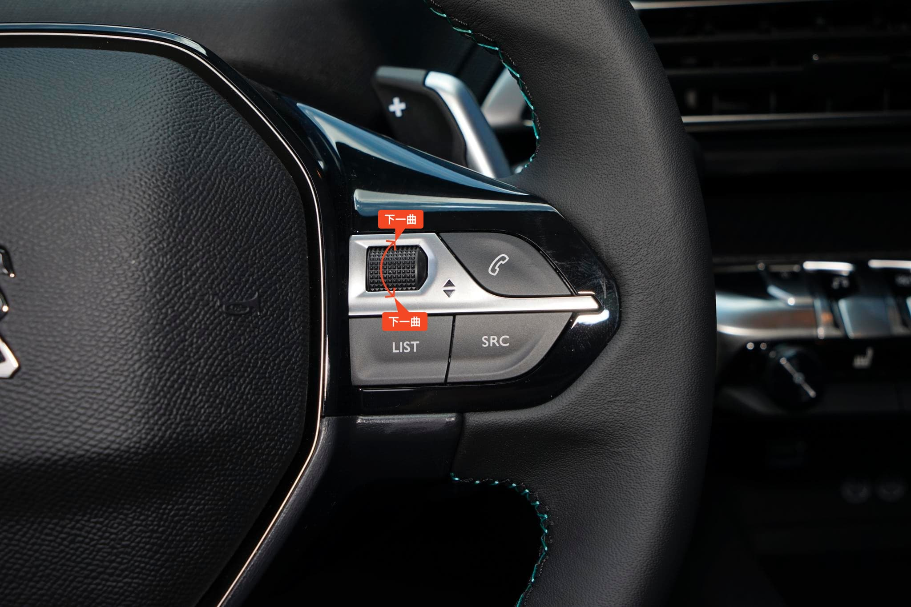
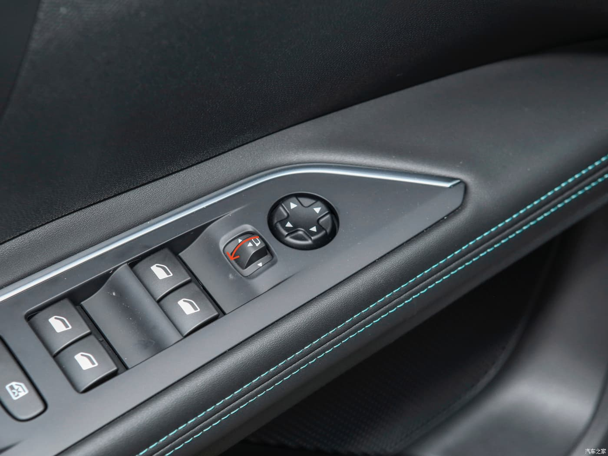

# 常见问题

收集用车过程中一些常见的问题，比如：[切换远光灯](#切换远光灯)、[切换雾灯](#切换雾灯)、[切换音乐上/下一曲](#切换音乐上-下一曲)、[手动开关后视镜](#手动开关后视镜)。

## 切换远光灯

标致 4008 的灯光控制拨杆位于方向盘左侧。

**将拨杆向内轻拨一次，远光灯工作一次。**

**向内拨到底则开启远光灯，再次向内拨到底则关闭远光灯回到近光灯。**

::: details 查看灯光控制拨杆预览图

:::

## 切换雾灯

在位置灯或大灯点亮时，向上转动开启后雾灯，向下转动关闭后雾灯。

::: details 切换雾灯拨杆预览图

:::

> 在晴天、雨天、白天和晚上都不应使用前后雾灯。如果在以上情况下点亮雾灯， 其较强的光线就会造成其他驾驶员眩目。
>
> 只有在雾天或下雪天才能使用雾灯。 一旦不需要使用前后雾灯，请立即将其关闭。

## 切换音乐上/下一曲

连接 Carplay 听音乐时，会遇到一个常见的需求，就是切换下一曲音乐。

标致 4008 的切换音乐在主驾位方向盘右方的旋钮，跟其他大多数车型相比不同的操作方式，**切换下一曲向上拨动旋钮，切换下一曲向下拨动旋钮**。

::: details 使用右侧旋钮切换音乐上/下一曲

:::

## 手动开关后视镜

标致 4008 科技版拥有锁车自动收起后视镜的功能，当遇到窄路避让时，需要驾驶员手动收起后视镜避免刮蹭。

操作方式是：在假设未左侧控制后视镜调节方向的中间的按钮向后拉取可以手动收起后视镜，再次重复操作可以打开后视镜。

::: details 手动开关后视镜

:::