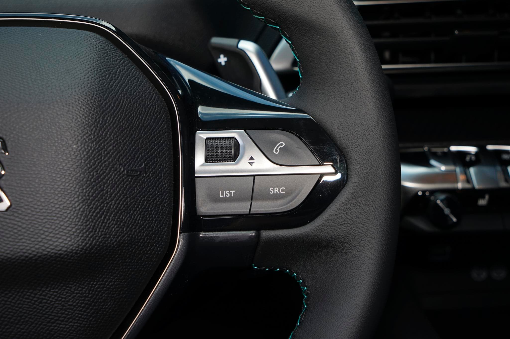
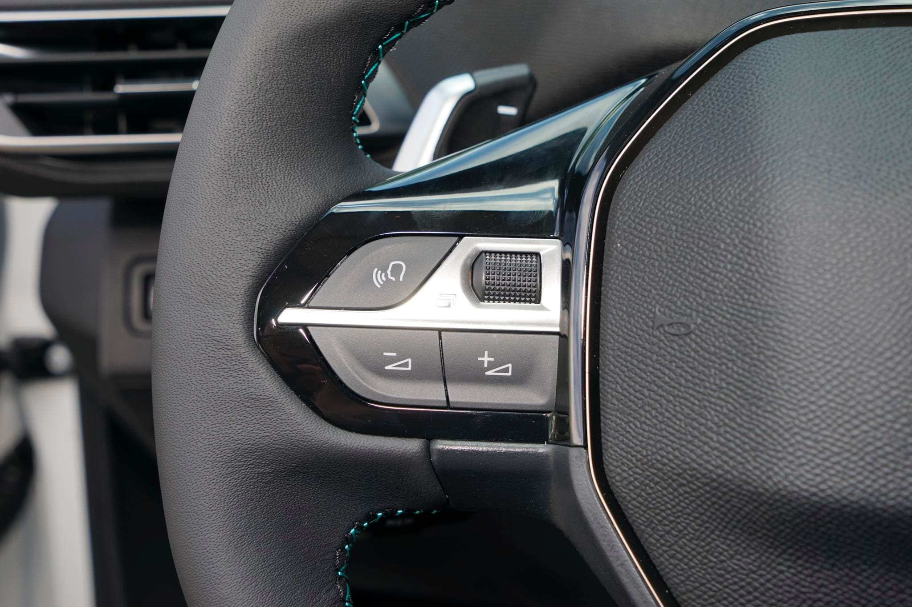
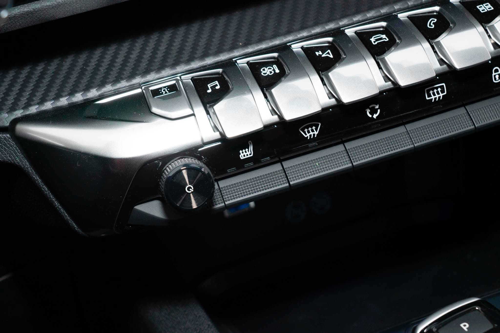

# 多媒体静音

在使用标致 4008 驾驶的过程中，常常会通过播放美妙的音乐来增加驾驶体验，而一些情况下我们需要保持车内短暂或常时间的安静。

比如：1. 车内其他成员接听电话（需要短暂的保持车内安静）；2. 车内其他成员休息（需要保持一段时间的安静） 

然而就这么一个简单的需求，在早期使用 4008 驾驶的过程中，由于操作不熟练，常常会手忙脚乱。

下面就总结一下标致 4008 将多媒体静音的一些方式。

## 快速静音

1. 长按方向盘右侧的 **`SRC`** 按钮设置车辆静音，再次长按 **`SRC`** 取消车辆静音
    > **推荐使用这种方式短暂保持多媒体静音，理由：操作便捷。**
    ::: details 点击查看按钮预览图
    
    :::
2. 同时按下方向盘左侧的音量减和音量加来设置车辆静音，再次同时按下取消车辆静音
    ::: details 点击查看按钮预览图
    
    :::
3. 按下中控钢琴键左侧的音量调节旋钮设置车辆静音，再次按下取消车辆静音
    ::: details 点击查看旋钮预览图
    
    :::

以上操作方式中，`1`、`2` 是针对主驾驶操作，而 `3` 则是针对主副驾驶均可操作，达到快速实现多媒体静音的效果。

其中通过方式 `3` 的方式操作的话，会将中控显示屏黑屏（显示当前时间信息），请酌情使用。

## 逐步调节至静音

1. 长按方向盘音量减来降低多媒体音量直至静音，待需要取消静音时长按音量加增加多媒体音量
   ::: details 点击查看按钮预览图
   
   :::
2. 转动中控钢琴键左侧的音量调节，向左转动旋钮降低音量，直至静音，向右转动旋钮增加音量
   ::: details 点击查看旋钮预览图
   
   :::

> **注意：**
> 通过上面方式将车辆测试为静音会有一个弊端，如果在下次启动车辆再播放多媒体音乐时会出现没有声音的情况，需要通过长按方向盘左侧音量加或中空钢琴键左侧音量调节按钮向右转动来增加音量来增加音量。

以上是目前整理的标致 4008 在使用车辆时快速静音和逐步调节至静音的方式，如果后续有更加便捷的操作到时再做补充。