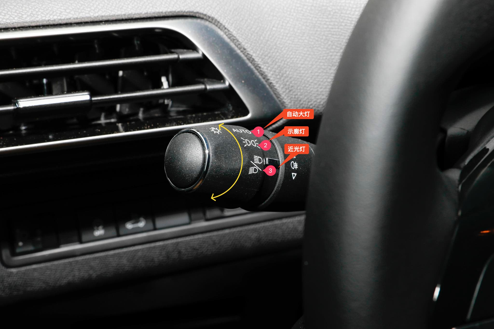
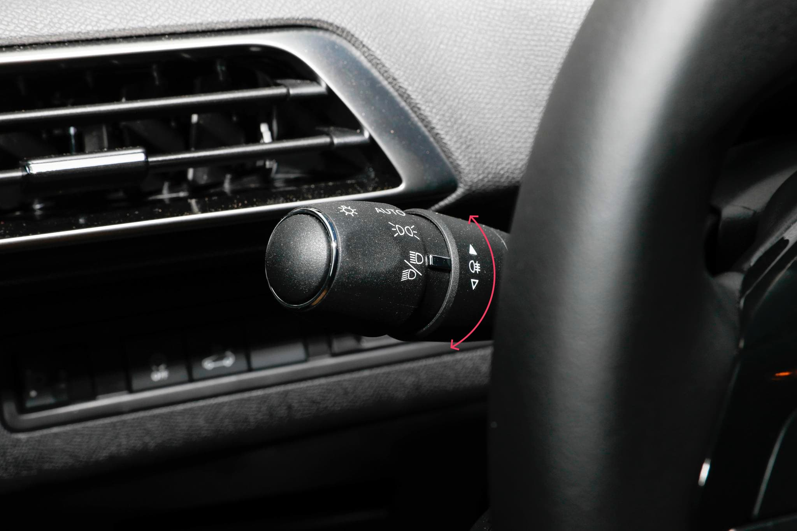

# 独特设计

## 切换远光灯

标致 4008 的灯光控制拨杆位于方向盘左侧。

**将拨杆向内轻拨一次，远光灯工作一次。**

**向内拨到底则开启远光灯，再次向内拨到底则关闭远光灯。**

::: details 查看灯光控制拨杆预览图

:::

## 切换雾灯

在位置灯或大灯点亮时，向上转动开启后雾灯，向下转动关闭后雾灯。

::: details 切换雾灯拨杆预览图

:::

> 在晴天、雨天、白天和晚上都不应使用前后雾灯。如果在以上情况下点亮雾灯， 其较强的光线就会造成其他驾驶员眩目。
> 
> 只有在雾天或下雪天才能使用雾灯。 一旦不需要使用前后雾灯，请立即将其关闭。
 